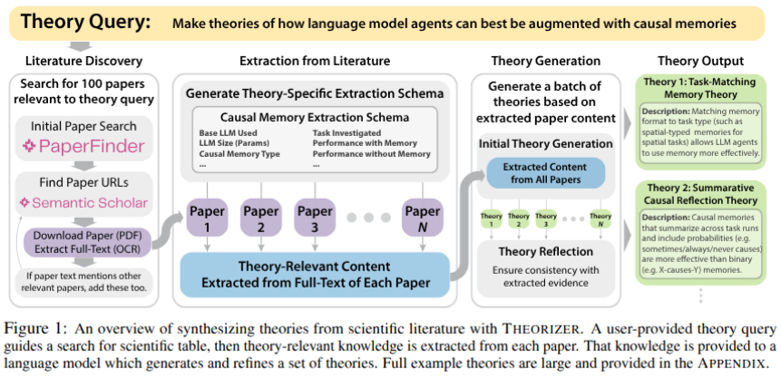
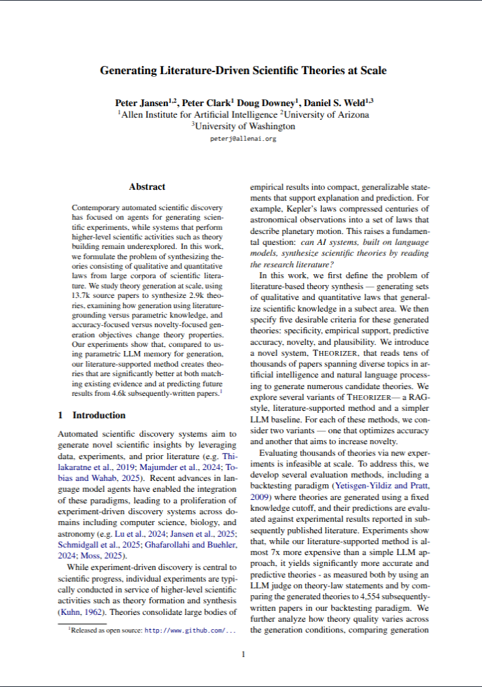
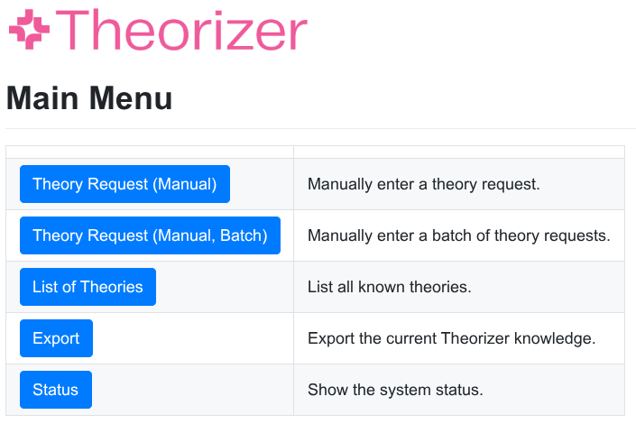
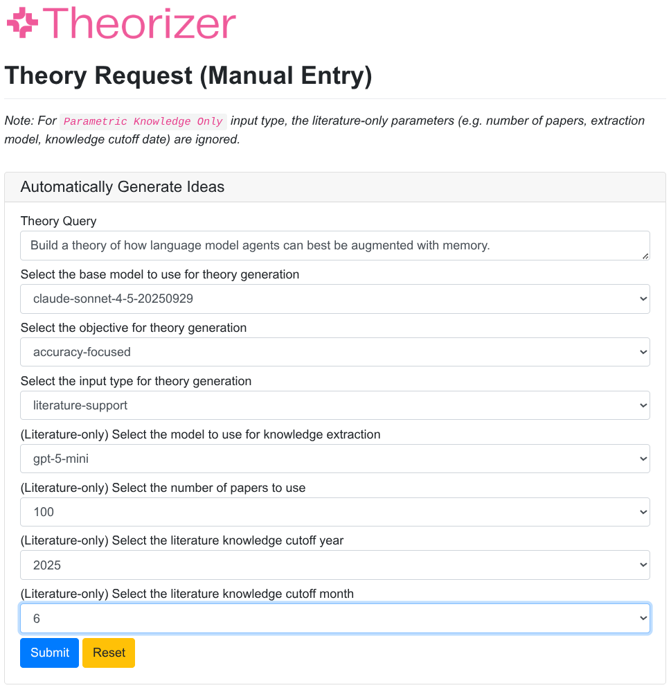
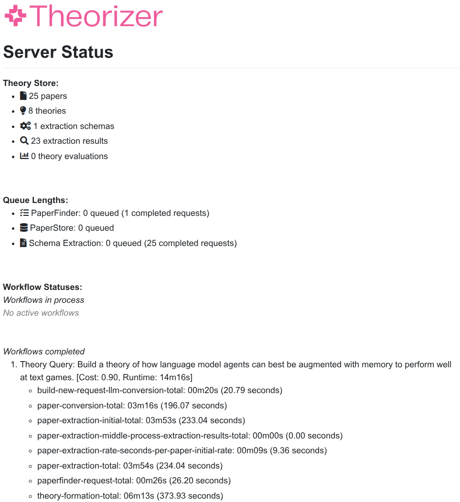
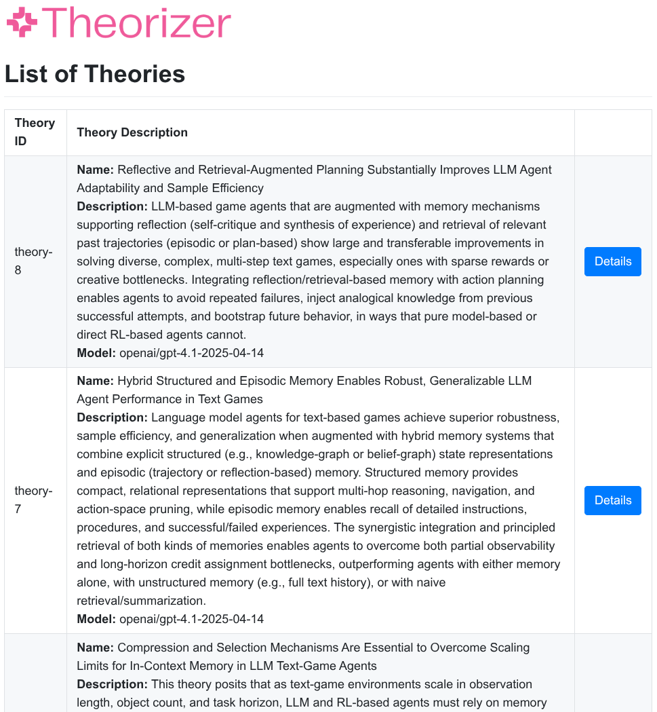
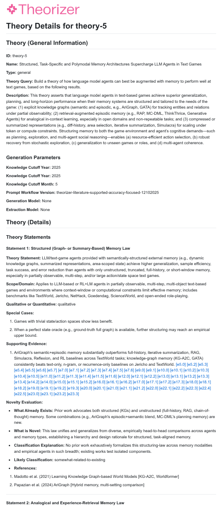
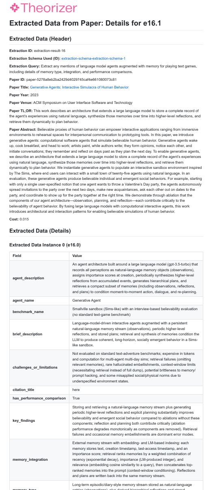
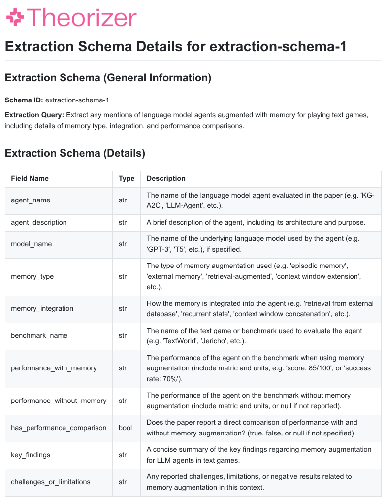

---

# Generating Literature-Driven Scientific Discoveries at Scale

This is the repository for Theorizer, from the paper Generating Literature-Driven Scientific Discoveries at Scale.

*Abstract:* Contemporary automated scientific discovery has focused on agents for generating scientific experiments, while systems that perform higher-level scientific activities such as theory building remain underexplored. In this work, we formulate the problem of synthesizing theories consisting of qualitative and quantitative laws from large corpora of scientific literature. We study theory generation at scale, using 13.7k source papers to synthesize 2.9k theories, examining how generation using literature-grounding versus parametric knowledge, and accuracy-focused versus novelty-focused generation objectives change theory properties. Our experiments show that, compared to using parametric LLM memory for generation, our literature-supported method creates theories that are significantly better at both matching existing evidence and at predicting future results from 4.6k subsequently-written papers.

<div align="center">

</div>

*Plain Language Overview:* Existing work in automated scientific discovery largely focuses on running new experiments, rather than higher-level scientific activities like theory building.  In this work we show language model agents can be used for theory building, too.  In normal usage, you provide a theory query (e.g. `build theories about X`), and the system uses this to find up to 100 papers related to that theory.  It reads each of these papers, extracts relevant evidence from them that might be useful for building theories, and then uses this evidence to synthesize about 4-8 theories per theory query.  How do you know if the generated theories are good theories?  There are a number of desirable qualities of theories, such as making accurate predictions of future scientific results, and of being new compared to previous theories.  We examine several methods of making theories, including using scientific literature versus only the language model's own knowledge, and asking the model to focus on making accurate theories, or new theories.  We made 100 theory queries broadly across different areas of AI and Natural Language Processing, and used these to synthesize approximately 3,000 theories from reading almost 14,000 papers.  What we found is that different methods of making theories affect their properties (like how accurate or novel they are), with some methods making theories that are (on average) 90% accurate at predicting future scientific results. 

---

# Table of Contents

- [1. Paper](#1-paper)
- [2. Quick Start](#2-quick-start)
  - [2.1. Is Theorizer limited to making theories in Computer Science/AI?](#2-1-is-theorizer-limited-to-making-theories-in-computer-scienceai)
  - [2.2. I want to read about Theorizer or generating theories from scientific literature](#2-2-i-want-to-read-about-theorizer-or-generating-theories-from-scientific-literature)
  - [2.3. I want to examine the theories, evaluations, and other results created by Theorizer](#2-3-i-want-to-examine-the-theories-evaluations-and-other-results-created-by-theorizer)
  - [2.4. I want to run Theorizer on my local machine](#2-4-i-want-to-run-theorizer-on-my-local-machine)
  - [2.5. I would like to generate theories on my own theory queries](#2-5-i-would-like-to-generate-theories-on-my-own-theory-queries)
  - [2.6. I have a question not answered here](#2-6-i-have-a-question-not-answered-here)
- [3. Installation and Running](#3-installation-and-running)
  - [3.1. Installation Instructions](#3-1-installation-instructions)
    - [3.1.1. LLM API keys](#3-1-1-llm-api-keys)
    - [3.1.2. Semantic Scholar API key](#3-1-2-semantic-scholar-api-key)
    - [3.1.3. Asta Paper Finder](#3-1-3-asta-paper-finder)
  - [3.2. Running (Web User Interface)](#3-2-running-web-user-interface)
  - [3.3. Running (API)](#3-3-running-api)
- [4. Using Theorizer for Theory Generation](#4-using-theorizer-for-theory-generation)
  - [4.1. Main Menu](#4-1-main-menu)
  - [4.2. Submitting a theory query](#4-2-submitting-a-theory-query)
  - [4.3. Monitoring active theory generation requests](#4-3-monitoring-active-theory-generation-requests)
  - [4.4. Saving / Exporting Theories](#4-4-savingexporting-theories)
  - [4.5. List of Generated Theories](#4-5-list-of-generated-theories)
  - [4.6. Examine Specific Theory](#4-6-examine-specific-theory)
  - [4.7. Examine Specific Evidence used to Build a Theory](#4-7-examine-specific-evidence-used-to-build-a-theory)
  - [4.8. Examine Specific Extraction Schema](#4-8-examine-specific-extraction-schema)
- [5. Theory Evaluation](#5-theory-evaluation)
  - [5.1. LLM-as-a-judge evaluation](#5-1-llm-as-a-judge-evaluation)
  - [5.2. Predictive Accuracy Evaluation](#5-2-predictive-accuracy-evaluation)
  - [5.3. Qualified Novelty Evaluation](#5-3-qualified-novelty-evaluation)
  - [5.4. Self-assessed Belief / Bayesian Surprise](#5-4-self-assessed-belief--bayesian-surprise)
- [6. Data, Example Output, and Theorizer Representation Formats](#6-data-example-output-and-theorizer-representation-formats)
  - [6.1. Representation Formats](#6-1-representation-formats)
  - [6.2. Small / Toy Theory Dataset](#6-2-smalltoy-theory-dataset)
  - [6.3. Real Theory Dataset (from the Theorizer paper)](#6-3-real-theory-dataset-from-the-theorizer-paper)
- [7. Prompts](#7-prompts)
- [8. Citation](#8-citation)
- [9. License](#9-license)
- [10. Contact](#10-contact)

---

<span id="1-paper"/>

## 1. Paper 

*Theorizer* is described in the following paper: [Generating Literature-Driven Scientific Theories at Scale [Arxiv/PDF]]([https://arxiv.org](https://arxiv.org/abs/2601.16282)).

<div align="center">
<table> <tr> <td>
        
</td> </tr> </table>
</div>

<span id='1-quick-start'/>


## 2. Quick Start

<span id="2-1-is-theorizer-limited-to-making-theories-in-computer-scienceai"/>

### 2.1. Is Theorizer limited to making theories in Computer Science/AI?
You can use Theorizer to make theories in any discipline indexed by Semantic Scholar, and we have used it internally to generate theories in other domains (e.g. biomedical).  The only limitation for a given field is whether the papers are likely to be downloadable by Theorizer as open-access.

<span id="2-2-i-want-to-read-about-theorizer-or-generating-theories-from-scientific-literature"/>

### 2.2. I want to read about Theorizer or generating theories from scientific literature
The Theorizer paper is available here: [Section 1. Paper](#1-paper)

<span id="2-3-i-want-to-examine-the-theories-evaluations-and-other-results-created-by-theorizer"/>

### 2.3. I want to examine the theories, evaluations, and other results created by Theorizer
- Real data (theories, theory queries, and evaluations) from the paper are available here: [Section 6.3. Real Theory Dataset (from the Theorizer paper)](#6-3-real-theory-dataset-from-the-theorizer-paper)
- Toy data (if you'd just like a small download, to examine the format) is available here: [Section 6.2. Small / Toy Theory Dataset](#6-2-smalltoy-theory-dataset)

<span id="2-4-i-want-to-run-theorizer-on-my-local-machine"/>

### 2.4. I want to run Theorizer on my local machine
Please see the installation instructions in: [Section 3. Installation and Running](#3-installation-and-running)

<span id="2-5-i-would-like-to-generate-theories-on-my-own-theory-queries"/>

### 2.5. I would like to generate theories on my own theory queries
To use Theorizer on your own theory queries, simply install it on your local machine, and submit theory queries.  Note that each theory query may take approximately 30-60 minutes, depending on the rate limits of your API access, the number of papers selected, and the speed of the generating model. 

<span id="2-6-i-have-a-question-not-answered-here"/>

### 2.6. I have a question not answered here. 
Please see the documentation below.  If you're question isn't answered, please add an issue, or send an e-mail: [Section 10. Contact](#10-contact)

<span id="3-installation-and-running"/>

## 3. Installation and Running

The installation has been tested working on Ubuntu Linux.  It will likely work with minimal modification on MacOS, and some modification under Windows.

<span id="3-1-installation-instructions"/>

### 3.1 Installation Instructions

Clone the repository:
```
git clone https://github.com/allenai/theorizer
cd theorizer
```

Create a conda environment:
```
conda create --name theorizer python=3.12
conda activate theorizer
```

Install the dependencies:

```
pip install -r requirements.txt
```

<span id="3-1-1-llm-api-keys"/>

#### 3.1.1. LLM API keys
Create a file called `api_keys.donotcommit.json` that contains the required API keys for LLM access:
(the Mistral key is required for `PDF -> Markdown` conversion)
```
{
    "openai": "sk-proj-...",
    "anthropic": "sk-ant-...",
    "mistral": "..."
}
```

<span id="3-1-2-semantic-scholar-api-key"/>

#### 3.1.2. Semantic Scholar API key
Create a file called `s2_key.donotcommit.txt` that contains a single line with your semantic scholar key:
```
<your key here>
```

<span id="3-1-3-asta-paper-finder"/>

#### 3.1.3. Asta Paper Finder
Generating literature-supported theories using Theorizer requires the use of the local copy of Asta PaperFinder.  The installation is quick, and its installation instructions can be found here:

```
https://github.com/allenai/asta-paper-finder
```

<span id="3-2-running-web-user-interface"/>

### 3.2. Running (Web User Interface)

There are two components that need to run simultaneously -- the back-end server, and the user-facing web server. In two terminals, run:

Back-end server:
```
python src/TheorizerServer.py
```

User-facing Server:
```
python src/TheorizerWebInterface.py
```

If you point your web browser to `localhost:8080`, then you should see the Theorizer interface.

<span id="3-3-running-api"/>

### 3.3. Running (API)

You can also submit theory requests to Theorizer programmatically, by starting the `TheorizerServer.py`, and sending appropriately formatted requests to `localhost:5002`.  The endpoint examples are in `TheorizerWebInterface.py`. 

TODO: Make stand-alone API example.


<span id="4-using-theorizer-for-theory-generation"/>

## 4. Using Theorizer for Theory Generation

⚠️**Costs**⚠️: Use of this code for theory generation, evaluation, or other purposes can incur significant costs.  It is strongly encouraged to start small scale to gauge approximate costs, and to use API keys with hard limits to avoid accidental/unexpected cost overruns. 

<span id="4-1-main-menu"/>

### 4.1 Main Menu

Opening `http://localhost:8080/` in a web browser with both the Server and Web Interface running should show the main user interface menu of Theorizer: 

<div align="center">

</div>

<span id="4-2-submitting-a-theory-query"/>

### 4.2. Submitting a theory query

The main menu has two buttons for submitting theories.  The top button is for submitting a single query, and the second button is for submitting a batch of theory queries using the same configuration. 

<div align="center">

</div>

The parameters are: 

1. **Theory Query:** The request for theories.  This can be as specific or general as you'd like, and for any topic that Semantic Scholar/PaperFinder reasonably will find a broadly available selection of open-access papers for.
2. **Model for Theory Generation:** This is the model that will be used to view aggregated evidence from the literature, and infer/deduce/synthesize the set of theories.  It should be a powerful model.
3. **Objective for Theory Generation:** This allow selecting between the `accuracy-focused` and `novelty-focused` prompts for theory generation.
4. **Input-type for Theory Generation:** You can use either papers/literature to collect evidence for theory generation, or you can use the LLM's own parametric knowledge.

The remaining parameters only apply if you selected generating `literature-supported` (not `parametric`) theories:

5. **Model for Literature Extraction:** This is the model that will be used to extract knowledge from each paper.  This will be called a lot, so typically you'll want to use an inexpensive model. 
6. **Number of Papers:** The maximum number of papers to find/download for generating literature-supported theories.
7. **Knowledge Cutoff (Year/Month):** When downloading papers, only include papers that were authored before this Year/Month. 

When you click `submit`, after a few moments you should see a message that says the server successfully accepted the theory request, and is processing it.

<span id="4-3-monitoring-active-theory-generation-requests"/>

### 4.3. Monitoring active theory generation requests

<div align="center">

</div>

It can take approximately 30-60 minutes for a literature-supported theory request to finish in the queue.  You can monitor the status by examining the server status on the main menu.  When a given theory query workflow is completed, its theories will automatically show up in the list of theories. 

<span id="4-4-savingexporting-theories"/>

###  4.4. ⚠️ Saving/Exporting Theories ⚠️ 

🚨 It's important to save theories after you've generated them, so that they are retained.  If you don't save your theories, they will disappear after you restart the interface. 🚨

Use the `Export` button on the main menu to export your:

1. **TheoryStore:** a JSON object that represents all the theories, extraction schemas, extraction results, and so forth.
2. **PaperStore:** a JSON cache of all the papers used to build the theories.

If you'd like to reload your theories into the web interface after exporting them, you'll need to manually enter the filename of your theory export at the bottom of `TheorizerServer.py`. 

*Failsafe:* By default, the interface does attempt to automatically export a backup copy of the TheoryStore after processing each theory request (and these are saved as the `theorizer-state-autosave-*.json` files in the main execution path).  But, you should not rely on this to save the theories, and should manually export the theories using the `Export` functionality when you wish to save them.  Please note that the auto-save functionality does not export the PaperStore, but the `Export` button does.

<span id="4-5-list-of-generated-theories"/>

### 4.5. List of Generated Theories

After theory query workflows have successfully completed, their theories will appear in the Theory List.  You can select a theory to see more details.

<div align="center">

</div>

<span id="4-6-examine-specific-theory"/>

### 4.6. Examine Specific Theory

Clicking on the `details` button of a specific theory will reveal the details of that theory, including its description, laws, generation parameters, etc.:

<div align="center">

</div>

<span id="4-7-examine-specific-evidence-used-to-build-a-theory"/>

### 4.7. Examine Specific Evidence used to Build a Theory

You can examine specific evidence extracted from a paper to build a theory by clicking on the evidence links (e.g. `[e123.1]`).  These pages include a header that shows the paper that the evidence was extracted from, as well as list of specific instances of evidence according to the extraction schema:

<div align="center">

</div>

<span id="4-8-examine-specific-extraction-schema"/>

### 4.8. Examine Specific Extraction Schema 

For a given piece of extracted evidnece, you can also click on its schema link to examine the extraction schema generated in response to the theory query, and applied to extract evidence from each apper: 

<div align="center">

</div>


<span id="5-theory-evaluation"/>

## 5. Theory Evaluation

<span id="5-1-llm-as-a-judge-evaluation"/>

### 5.1. LLM-as-a-judge evaluation (Table 1)

Code: The LLM-as-a-judge evaluation code is available here: [src/EvaluationLLMAsAJudge.py](src/EvaluationLLMAsAJudge.py)

Example output: 
```
...
LLM-as-a-judge evaluation complete.

Final average evaluation scores (formatted):
Dimension                      Average Score   Counts              
factual_accuracy               6.18            45                  
specificity                    7.36            45                  
novelty                        5.73            45                  
testability                    7.98            45                  
plausibility                   7.24            45                  
empirical_testing              2.69            45                  

Results saved to: ...
```

<span id="5-2-predictive-accuracy-evaluation"/>

### 5.2. Predictive Accuracy Evaluation (Table 2)

Code: The predictive accuracy evaluation code is available here: [src/EvaluationPredictiveAccuracy.py](src/EvaluationPredictiveAccuracy.py)

Example output: 
```
...
Summary of predictive accuracy evaluations:
Precision:
{
    "average_evaluation": {
        "support": 1.0,
        "contradict": 0.0,
        "count": 2
    }
}

Recall:
{
    "count_theories_has_data": 2,
    "count_theories_no_data": 0,
    "proportion_theories_with_data": 1.0,
    "count_elems_has_data": 6,
    "count_elems_no_data": 5,
    "proportion_elems_with_data": 0.5454545454545454
}

Other:
{
    "count_total_papers_evaluated": 20,
    "count_total_papers_with_relevant_info": 9,
    "avg_papers_with_relevant_info": 4.5,
    "count_total_laws_with_relevant_info": 2
}
Wrote summary to: theorystore-example-predictive-evaluation/predictive-accuracy-evaluation/claude_sonnet_4_5_20250929/predictive_accuracy_summary.json
Predictive accuracy evaluation complete.
```

<span id="5-3-qualified-novelty-evaluation"/>

### 5.3. Qualified Novelty Evaluation (Table 3)

Code: The qualified novelty evaluation code is available here: [src/EvaluationQualifiedNovelty.py](src/EvaluationQualifiedNovelty.py)

Example output: 
```
...
Found 5 novelty evaluation files in: qualified-novelty-evaluations/literature-supported/
Novelty Evaluation Histogram:
{
    "path_in": "qualified-novelty-evaluations/literature-supported/",
    "histogram_proportions": {
        "phenomenon_effect": {
            "not_novel": 1.0,
            "novel": 0.0
        },
        "explanatory_mechanistic": {
            "not_novel": 0.2,
            "novel": 0.8
        },
        "unification": {
            "not_novel": 0.4,
            "novel": 0.6
        },
        "generalization_scope_expansion": {
            "not_novel": 0.4,
            "novel": 0.6
        },
        "constraint_limitation": {
            "not_novel": 1.0,
            "novel": 0.0
        },
        "conceptual_reframing_abstraction": {
            "not_novel": 0.6,
            "novel": 0.4
        },
        "empirical_synthesis_meta_regulariry": {
            "not_novel": 0.6,
            "novel": 0.4
        }
    },
    "histogram_raw_counts": {
        "phenomenon_effect": {
            "not_novel": 4,
            "novel": 0
        },
        "explanatory_mechanistic": {
            "not_novel": 1,
            "novel": 4
        },
        "unification": {
            "not_novel": 2,
            "novel": 3
        },
        "generalization_scope_expansion": {
            "not_novel": 2,
            "novel": 3
        },
        "constraint_limitation": {
            "not_novel": 5,
            "novel": 0
        },
        "conceptual_reframing_abstraction": {
            "not_novel": 3,
            "novel": 2
        },
        "empirical_synthesis_meta_regulariry": {
            "not_novel": 3,
            "novel": 2
        }
    },
    "total_cost_all_evaluations": 5.84496665,
    "num_evaluations": 5,
    "average_cost_per_evaluation": 1.16899333,
    "average_papers_per_evaluation": 23.0,
    "stddev_papers_per_evaluation": 0.0,
    "total_papers_evaluated": 115.0
}

Total Cost for all evaluations: $5.84
Number of evaluations: 5
Average Cost per evaluation: $1.17
Average Number of papers evaluated per evaluation: 23.00 ± 0.00
Total papers evaluated across all evaluations: 115
Writing overall qualified novelty evaluation summary to: theorystore-example2-literaturesupported-qualified-novelty-evaluation.20260114-121058.json
```

<span id="5-4-self-assessed-belief--bayesian-surprise"/>

### 5.4. Self-assessed Belief/Bayesian Surprise (Table 2)

Code: The self-assessed belif/Bayesian surprise evaluation code is available here: [src/EvaluationSurprisal.py](src/EvaluationSurprisal.py)

Example output: 
```
Surprisal / Belief Elicitation evaluation complete.
--------------------------------------------------------------------------------

Total laws evaluated: 45
Model used: gpt-4.1-2025-04-14
Number of samples per law: 10
Average (of average) probability that the model believes the laws to be true: 0.809
Standard deviation of the average probabilities: 0.045

Results saved to: theorystore-example-single-laws.surprise_evaluated.20260114-104415.json
```

<span id="6-data-example-output-and-theorizer-representation-formats"/>

## 6. Data, Example Output, and Theorizer Representation Formats

<span id="6-1-representation-formats"/>

### 6.1. Representation Formats

The primary data structure saved by Theorizer is the `TheoryStore`.  At a top-level, dictionary contains the following keys:

- `theories`: A dictionary of theories, each containing their high-level descriptions, components, and lists of theory laws/statements.
- `extraction_schemas`: A dictionary of extraction schemas built for extracting evidence from papers.
- `extraction_results`: A dictionary of specific extraction results -- that is, using an extraction schema to extract evidence from a paper.
 
Theorizer also generates a secondary data structure, the `PaperStore`, which is a cache of the papers Theorizer has downloaded and extracted the full text of using the OCR converter. 

<span id="6-2-smalltoy-theory-dataset"/>

### 6.2. Small/Toy Theory Dataset

Two small sets of theories, one generated using literature support, and one using parametric knowledge, along with sample evaluations, are provided in: [example-theories/toy-data](example-theories/toy-data) 

While the JSON is provided, the easiest way to view the example theories is in HTML format: [example-theories/toy-data/html/index.html](example-theories/toy-data/html/index.html) 

Please note that these toy theories are provided primarily as format examples, as small downloads.  The PaperStores are not included due to copyright, and any paper full-text is sanitized from the evaluation files. 

<span id="6-3-real-theory-dataset-from-the-theorizer-paper"/>

### 6.3. Real Theory Dataset (from the Theorizer paper)

The theories generated in the paper are available here: [example-theories/theorizer-paper-data](example-theories/theorizer-paper-data) 

<span id="7-prompts"/>

## 7. Prompts

The core prompts used in this work can be found at the following locations in the source:

*Schema Generation Prompts:*
- Converting a theory query into a schema: [src/TheorizerProcessing.py#L18](src/TheorizerProcessing.py#L18)

*Prompts for Extracting Evidence from Papers:*
- Populating a schema with evidence from one paper: [src/SchemaExtractionQueue.py#L285](src/SchemaExtractionQueue.py#L285)

*Theory Generation Prompts:*
- Theory Generation (accuracy-focused, with literature): [src/TheorizerProcessing.py#L227](src/TheorizerProcessing.py#L227)
- Theory Generation (accuracy-focused, with parametric knowledge): [src/TheorizerProcessing.py#L688](src/TheorizerProcessing.py#L688)
- Theory Generation (novelty-focused, with literature): [src/TheorizerProcessing.py#L1202](src/TheorizerProcessing.py#L1202)
- Theory Generation (novelty-focused, with parametric knowledge): [src/TheorizerProcessing.py#L1590](src/TheorizerProcessing.py#L1590)

*Evaluation: LLM-as-a-judge (Table 1):*
- LLM-as-a-judge prompt: [src/EvaluationLLMAsAJudge.py#L26](src/EvaluationLLMAsAJudge.py#L26)

*Evaluation: Predictive Accuracy (Table 2):*
- Find relevant evaluation papers using PaperFinder: [src/EvaluationPredictiveAccuracy.py#L26](src/EvaluationPredictiveAccuracy.py#L26)
- Build the prediction rubric: [src/EvaluationPredictiveAccuracy.py#L421](src/EvaluationPredictiveAccuracy.py#L421)
- Score one paper with the prediction rubric: [src/EvaluationPredictiveAccuracy.py#L623](src/EvaluationPredictiveAccuracy.py#L623)

*Evaluation: Qualified Novelty (Table 3):*
- Qualified Novelty assessment (one paper): [src/EvaluationQualifiedNovelty.py#L25](src/EvaluationQualifiedNovelty.py#L25)
- Qualified Novelty assessment (aggregate results across papers): [src/EvaluationQualifiedNovelty.py#L393](src/EvaluationQualifiedNovelty.py#L393)

*Evaluation: Self-assessed Belief/Bayesian Surprise (Table 2):*
- Self-assessed belief: [src/EvaluationSurprisal.py#L25](src/EvaluationSurprisal.py#L25)


<span id="8-citation"/>

## 8. Citation
If you use this work, please reference the following citation:
```
@misc{jansen2026generatingliteraturedrivenscientifictheories,
      title={Generating Literature-Driven Scientific Theories at Scale}, 
      author={Peter Jansen and Peter Clark and Doug Downey and Daniel S. Weld},
      year={2026},
      eprint={2601.16282},
      archivePrefix={arXiv},
      primaryClass={cs.CL},
      url={https://arxiv.org/abs/2601.16282}, 
}
```

<span id="9-license"/>

## 9. License

Theorizer is released under an Apache 2.0 License.  The text of that license is included in this repository.

```
Disclaimer of Warranty. Unless required by applicable law or
agreed to in writing, Licensor provides the Work (and each
Contributor provides its Contributions) on an "AS IS" BASIS,
WITHOUT WARRANTIES OR CONDITIONS OF ANY KIND, either express or
implied, including, without limitation, any warranties or conditions
of TITLE, NON-INFRINGEMENT, MERCHANTABILITY, or FITNESS FOR A
PARTICULAR PURPOSE. You are solely responsible for determining the
appropriateness of using or redistributing the Work and assume any
risks associated with Your exercise of permissions under this License.
```

<span id="10-contact"/>

## 10. Contact

For any questions, please contact Peter Jansen (`peterj@allenai.org`).  For issues, bugs, or feature requests, please submit a github issue: TODO


